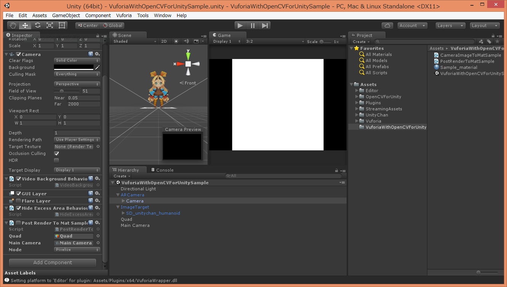

Vuforia with OpenCV for Unity Sample
====================

Demo Video
-----

Environment
-----
OSX Mavericks  
Unity 5.4.0f3
vuforia-unity-6-0-114.unitypackage
SD_UnityChan-1.unitypackage
OpenCV for Unity 2.0.6

In Unity 4.6, It seems the black screen problem occurs while using the combination of Vuforia and OpenCVForUnity.
I am investigating the cause.Unfortunately, please use the Unity5 at the moment.

Setup
-----
* Import vuforia-unity-6-0-114.unitypackage
* Import SD_UnityChan-1.unitypackage
* Setup Vuforia + UnityChan Tutorial(<http://taka-say.hateblo.jp/entry/2015/02/28/161103>(Japanese))
* Import OpenCVForUnity2.0.6 from AssetStore
* Import VuforiaWithOpenCVForUnitySample.unitypackage

 

Samples
-----
**[CameraImageToMatSample.cs](CameraImageToMatSample.cs)**  
Conversion from CameraImage(without augmentation) of "Vuforia" to Mat of "OpenCV for Unity".  

**[PostRenderToMatSample.cs](PostRenderToMatSample.cs)**  
Conversion from PostRenderTexture(ARCamera) of "Vuforia" to Mat of "OpenCV for Unity".  
Attach "PostRenderToMatSample.cs" to "ARCamera/Camera".  

