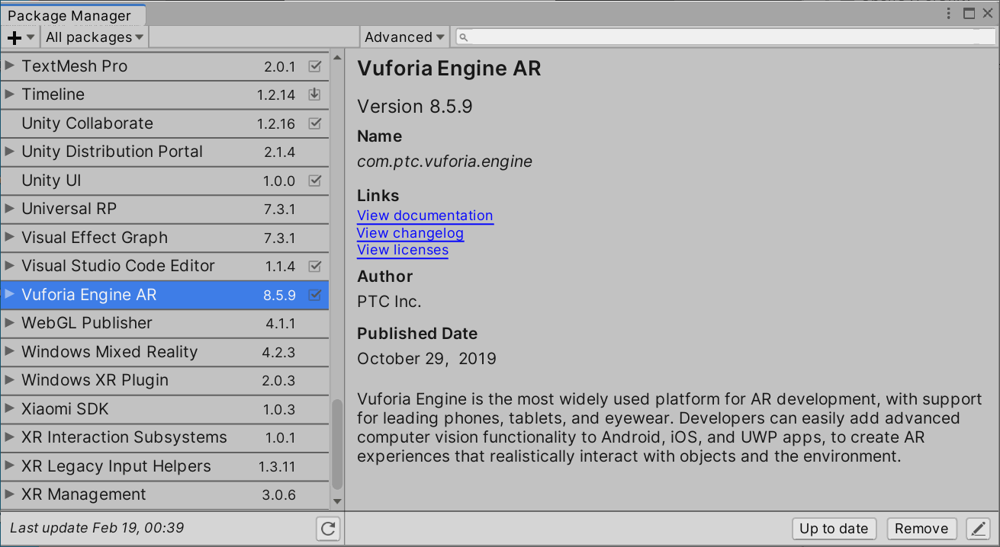
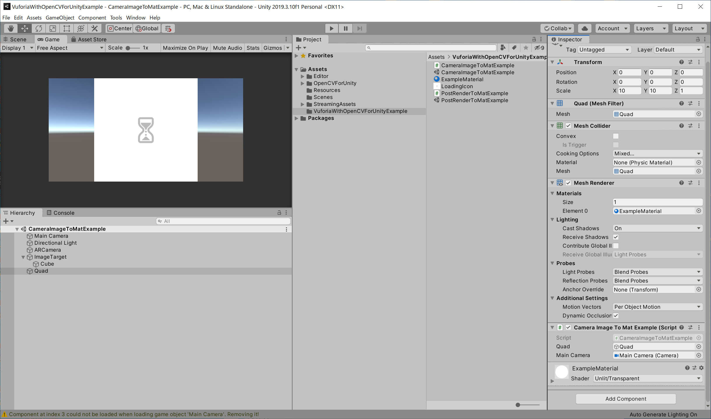
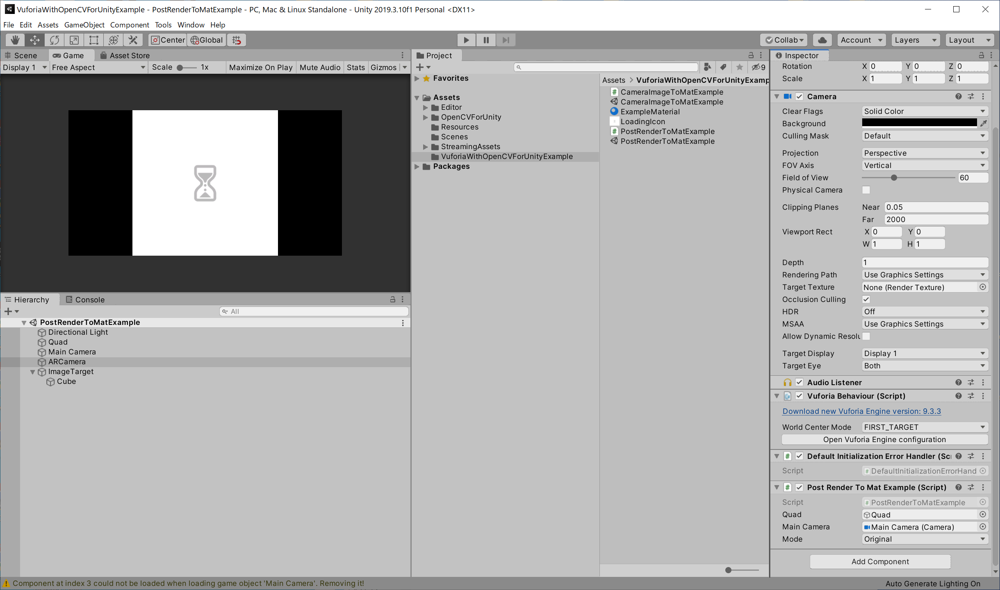

Vuforia with OpenCV for Unity Example
====================

Demo Video
-----

Environment
-----
Windows 10  
Unity 2019.3.10f1 
Vuforia Engine AR 8.5.9 
[OpenCV for Unity](https://assetstore.unity.com/packages/tools/integration/opencv-for-unity-21088?aid=1011l4ehR) 2.4.3

Setup
-----
* Setup Vuforia ([Getting Started with Vuforia Engine in Unity](https://library.vuforia.com/articles/Training/getting-started-with-vuforia-in-unity.html))

* Import OpenCVForUnity2.4.3 from AssetStore
* Import VuforiaWithOpenCVForUnityExample.unitypackage

Examples
-----
**[CameraImageToMatExample.cs](/Assets/VuforiaWithOpenCVForUnityExample/CameraImageToMatExample.cs)**  
Conversion from CameraImage(without augmentation) of "Vuforia" to Mat of "OpenCV for Unity".  
 

**[PostRenderToMatExample.cs](/Assets/VuforiaWithOpenCVForUnityExample/PostRenderToMatExample.cs)**  
Conversion from PostRenderTexture(ARCamera) of "Vuforia" to Mat of "OpenCV for Unity".  
 

